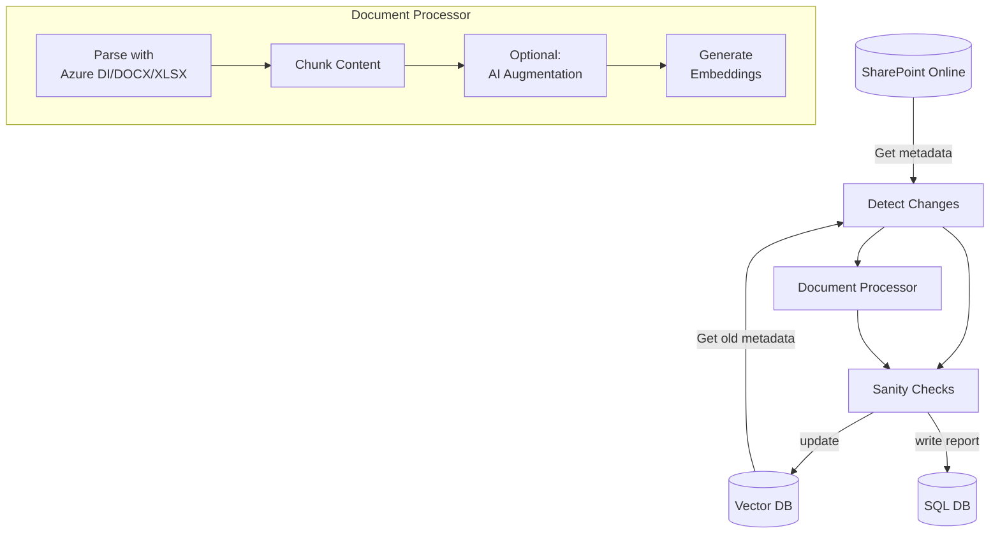

# ETL Pipeline for RAG Systems

Extract-Transform-Load (ETL) pipeline for Retrieval-Augmented Generation (RAG) systems. Extracts data from SharePoint Online, transforms it into optimized chunks, and loads it into a vector database.

---

## 📋 Table of Contents

- [Overview](#overview)
- [Architecture](#architecture)
- [Features](#features)
- [Project Structure](#project-structure)
- [Installation](#installation)
- [Configuration](#configuration)
- [Usage](#usage)
- [Testing](#testing)
- [Data Pipeline](#data-pipeline)
- [Development](#development)

---

## 🎯 Overview

This ETL pipeline processes documents from SharePoint Online for RAG applications:

- **Extracts** content from PDF, DOCX, XLSX, and ASPX files
- **Transforms** documents into intelligently chunked pieces with optional AI-powered augmentation
- **Loads** processed chunks into Weaviate vector database with rich metadata

### Key Capabilities

✅ **Multi-Format Support** - PDF, DOCX, XLSX, ASPX, TXT, MD  
✅ **Intelligent Chunking** - Markdown-aware, recursive, and character-based strategies  
✅ **AI Augmentation** - Optional LLM-powered chunk improvement  
✅ **Change Detection** - Incremental updates based on eTag tracking  
✅ **Rich Metadata** - Headers, keywords, page numbers, table summaries  
✅ **Comprehensive Testing** - 104 unit tests with 90% coverage

---

## 🏗️ Architecture



### Technology Stack

| Component | Technology |
|-----------|-----------|
| **Framework** | LangChain, LangGraph |
| **LLM/Embeddings** | Azure OpenAI (private instance) |
| **Document Processing** | Azure Document Intelligence |
| **Vector Database** | Weaviate |
| **Relational Database** | Microsoft SQL Server |
| **Document Source** | SharePoint Online (Microsoft Graph API) |
| **Testing** | pytest, pytest-cov, pytest-mock |

---

## ✨ Features

### Document Processing

- **PDF**: Azure Document Intelligence extraction to Markdown
- **DOCX**: Direct extraction with structure preservation + image interpretation
- **XLSX**: Sheet extraction as Markdown tables with dual embeddings
- **ASPX**: Parser ready (testing in progress)
- **TXT/MD**: Direct text extraction

### Chunking Strategies

1. **Markdown** - Preserves document structure with headers
2. **Recursive** - Intelligent splitting with configurable separators
3. **Character** - Simple fixed-size chunks

### Chunk Augmentation

- **None** - Fast processing, no augmentation
- **Summary** - Append document summary to each chunk
- **Iterative** - LLM-powered chunk improvement
- **Combined** - Both summary and iterative enhancement

### Change Detection

- **New Files** - Automatically detected and processed
- **Updated Files** - Re-processed when eTag changes
- **Deleted Files** - Removed from vector database
- **Incremental** - Only processes changes since last run

---

## 📁 Project Structure

```
etl/
├── ETL/                                    # Main application code
│   ├── run_workflow.py                     # ⭐ Main entry point
│   │
│   ├── nodes/                              # Workflow orchestration
│   │   ├── process_new_files.py
│   │   ├── compare_kbs.py
│   │   ├── delete_old_entries.py
│   │   ├── get_file_metadata_from_db.py
│   │   └── get_file_metadata_from_spo.py
│   │
│   ├── document_processor/                 # Core processing
│   │   ├── main_processor/
│   │   │   └── file_processor.py           # Main orchestrator
│   │   │
│   │   ├── base/                           # Foundation
│   │   │   ├── interfaces.py               # Parser, Chunker, Agent interfaces
│   │   │   └── models.py                   # RAGEntry, ProcessingConfig
│   │   │
│   │   ├── parsers/                        # Document parsers
│   │   │   ├── factory.py                  # Parser factory
│   │   │   ├── text_parser.py              # TXT, MD
│   │   │   ├── docx_parser.py              # DOCX
│   │   │   ├── excel_parser.py             # XLSX
│   │   │   ├── document_intelligence_parser.py  # PDF (Azure DI)
│   │   │   ├── vision_parser.py            # PDF (Vision)
│   │   │   └── aspx_parser.py              # ASPX
│   │   │
│   │   ├── chunkers/                       # Text chunking
│   │   │   ├── factory.py
│   │   │   ├── character_chunker.py
│   │   │   ├── recursive_chunker.py
│   │   │   └── markdown_chunker.py
│   │   │
│   │   ├── reconstruction/                 # AI augmentation
│   │   │   ├── factory.py
│   │   │   ├── null_agent.py               # No augmentation
│   │   │   ├── summary_agent.py            # Add summary
│   │   │   ├── iterative_agent.py          # Improve chunks
│   │   │   └── combined_agent.py           # Both strategies
│   │   │
│   │   └── utils/                          # Utilities
│   │       ├── settings.py
│   │       ├── keyword_generator.py
│   │       └── file_utils.py
│   │
│   ├── tools/                              # Additional tools
│   │   ├── doc_etl_components.py
│   │   ├── interpret_image.py
│   │   ├── process_docx.py
│   │   └── rag_chunking_agent/
│   │
│   └── db_access/                          # Database operations
│       └── ops.py
│
├── tests/                                  # Test suite
│   ├── unit/
│   │   ├── test_models.py                  
│   │   ├── test_chunkers.py                
│   │   ├── test_parsers.py                 
│   │   └── test_reconstruction.py          
│   └── fixtures/
│       └── test_data.py                    # Test utilities
│
├── scripts/
│   └── initial_setup/
│       └── docker-compose.yml              # Local Weaviate
│
├── requirements.txt                        # Production dependencies
├── requirements-test.txt                   # Test dependencies
├── pytest.ini                              # Pytest configuration
├── Dockerfile                              # Container setup
└── README.md                               # This file
```

### Key Files

| File | Purpose |
|------|---------|
| `ETL/run_workflow.py` | Main orchestrator - starts here |
| `ETL/document_processor/main_processor/file_processor.py` | Core processing logic |
| `ETL/document_processor/base/models.py` | Data models and configuration |
| `ETL/document_processor/base/interfaces.py` | Abstract base classes |
| `tests/` | comprehensive unit tests |

---

## 🚀 Installation

### Prerequisites

- Python 3.11 or higher
- Access to Azure OpenAI and Document Intelligence
- Weaviate instance (or Docker)
- SQL Server instance
- SharePoint Online credentials

### Quick Setup

```bash
# 1. Clone repository
git clone https://bis.ghe.com/bis/bis-gpt-rag-etl
cd bis-gpt-rag-etl

# 2. Create virtual environment
python -m venv .venv

# powershell
.venv\scripts\activate

# Linux/Mac
source venv/bin/activate

# 3. Install dependencies
pip install -r requirements.txt

# 4. Configure environment
create .env
# Edit .env with your credentials

# 5. (Optional) Setup local Weaviate
cd scripts/initial_setup
docker-compose up -d
cd ../..

# 6. Run ETL
python -m ETL.run_workflow
```

### Windows Certificate Setup

For Windows with BIS certificates:
```powershell
.\Add-BisSelfSignedCerts.ps1
```

---

## ⚙️ Configuration

### Environment Variables

Create a `.env` file in the project root:

```bash
# Application
RAG_APP_ID=your-app-id

# ETL Settings
ETL_PROD_ENV=true                           # Skip UAT folder
ETL_DOWNLOAD_AS_PDF=false                   # Download DOCX as PDF
ETL_CHUNK_AUGMENTATION_STRATEGY=none        # none|resume_on_top|iterative

# Vector Database (Weaviate)
WEAVIATE_URL=http://localhost:8080
WEAVIATE_COLLECTION_NAME=documents

# SharePoint Online
SPO_CLIENT_ID=your-client-id
SPO_SECRET=your-client-secret
SPO_ROOT=/sites/your-site
SPO_MAIN_FOLDER_PATH=Documents

# Azure OpenAI - Completion
AZURE_OAI_ENDPOINT=https://your-endpoint.openai.azure.com
AZURE_OAI_DEPLOYMENT=gpt-4
AZURE_OAI_API_VERSION=2024-02-01
AZURE_OAI_API_KEY=your-api-key

# Azure OpenAI - Embeddings
AZURE_OAI_EMB_ENDPOINT=https://your-endpoint.openai.azure.com
AZURE_OAI_EMB_DEPLOYMENT=text-embedding-3-large
AZURE_OAI_EMB_API_VERSION=2024-02-01
AZURE_OAI_EMB_API_KEY=your-api-key

# Azure Document Intelligence
AZURE_DI_ENDPOINT=https://your-di.cognitiveservices.azure.com
AZURE_DI_API_KEY=your-di-key

# SQL Server
MSSQL_SERVER=your-server.database.windows.net
MSSQL_DB_NAME=your-database
```

### Processing Configuration

Configure in code:

```python
from ETL.document_processor.base.models import ProcessingConfig

config = ProcessingConfig(
    # Parser
    parser_type="document_intelligence",    # or "vision"
    
    # Chunking
    chunking_strategy="recursive",          # "markdown", "recursive", "character"
    chunk_size=5000,
    chunk_overlap=500,
    separators=["\n\n", "\n", " "],
    
    # Augmentation
    chunk_augment_method="none",            # "none", "append_summary", 
                                            # "chunk_reconstruction", "both"
)
```

---

## 🎮 Usage

### Basic Usage

```bash
# Run the complete ETL pipeline
python -m ETL.run_workflow
```

### Programmatic Usage

```python
from ETL.document_processor.main_processor.file_processor import FileProcessor
from ETL.document_processor.base.models import ProcessingConfig
import weaviate

# Initialize
client = weaviate.connect_to_local()
config = ProcessingConfig(
    chunking_strategy="recursive",
    chunk_size=5000,
    chunk_augment_method="append_summary"
)

# Process file
processor = FileProcessor(client, config)
chunks = processor.process_file(
    file_path="document.pdf",
    file_metadata={
        "source": "https://sharepoint.com/doc.pdf",
        "file_name": "document.pdf",
        "document_title": "Important Document",
        "etag": "abc123"
    }
)

print(f"Created {len(chunks)} chunks")
```

### Using Factories

```python
from ETL.document_processor.parsers.factory import ParserFactory
from ETL.document_processor.chunkers.factory import ChunkerFactory
from ETL.document_processor.reconstruction.factory import ReconstructionAgentFactory

# Create parser
parser = ParserFactory.create_parser(".pdf", config)
content, images = parser.parse(file_path, metadata)

# Create chunker
chunker = ChunkerFactory.create_chunker(config)
documents = chunker.split_text(content)

# Create augmentation agent
agent = ReconstructionAgentFactory.create_agent(config, llm)
improved = agent.reconstruct_chunks(chunks, content)
```

---

## 🧪 Testing

### Test Suite Overview

```
tests/
├── __init__.py                          # Makes tests a package
├── README.md                            # Quick reference guide
│
├── unit/                                # Unit tests directory
│   ├── __init__.py                      # Unit tests package marker
│   ├── test_models.py                   # Tests for base models
│   ├── test_chunkers.py                 # Tests for chunkers
│   ├── test_parsers.py                  # Tests for parsers
│   └── test_reconstruction.py           # Tests for reconstruction
│
└── fixtures/                            # Shared test data and utilities
    ├── __init__.py                      # Fixtures package with exports
    └── test_data.py                     # Mock data and helper functions

```

### Running Tests

```bash
# Install test dependencies
pip install -r requirements-test.txt

# Set PYTHONPATH (Windows)
set PYTHONPATH=%cd%

# Set PYTHONPATH (Linux/Mac)
export PYTHONPATH="${PYTHONPATH}:$(pwd)"

# Run all tests
pytest tests/unit/ -v

# Run specific module
pytest tests/unit/test_models.py -v

# Run with coverage
pytest tests/unit/ --cov=ETL --cov-report=html
```

### Test Commands Reference

| Command | Purpose |
|---------|---------|
| `pytest tests/unit/ -v` | Run all tests verbose |
| `pytest tests/unit/ -v --tb=short` | Show short error details |
| `pytest tests/unit/ -v --tb=short -ra` | Full summary |
| `pytest tests/unit/ -x` | Stop on first failure |
| `pytest --lf -v` | Rerun only failed tests |
| `pytest tests/unit/ -v -s` | Show print statements |
| `pytest tests/unit/ -k config` | Run tests matching "config" |
| `pytest -n auto` | Run in parallel |
| `pytest --cov=ETL --cov-report=html` | Generate coverage report |

### Running Specific Tests

```bash
# Run specific test class
pytest tests/unit/test_models.py::TestProcessingConfig -v

# Run specific test method
pytest tests/unit/test_models.py::TestProcessingConfig::test_create_default_config -v

# Run with full error details
pytest tests/unit/test_models.py::TestProcessingConfig::test_create_default_config -vv --tb=long
```

---

## 📊 Data Pipeline

### Workflow Steps

1. **Get Metadata** from SharePoint Online and Vector DB
2. **Compare** to detect new, updated, and deleted files
3. **Process** each new/updated file:
   - Download file
   - Parse content (PDF/DOCX/XLSX)
   - Chunk content
   - Optionally augment chunks
   - Generate embeddings
   - Upsert to Weaviate
4. **Delete** entries for removed files
5. **Record** statistics to SQL Server

### Document Detection

Files are tracked using eTag (entity tag) for change detection:

- **New Documents**: Added since last run → Process and store
- **Updated Documents**: eTag changed → Delete old + insert new
- **Deleted Documents**: No longer exist → Remove from vector DB

### Extraction Process

#### PDF Files
- Uses Azure Document Intelligence
- Output in Markdown format
- Preserves structure and tables

#### DOCX Files
- Direct text extraction as Markdown
- Structure preserved (titles, sections)
- Images interpreted by multimodal LLM
- Text descriptions inserted at image positions

#### XLSX Files
- Each sheet extracted as Markdown table
- Two entries per table:
  1. Full table + embedding from description
  2. Table + summary + embedding from both

#### ASPX Files
- Parser implemented (testing in progress)

### Transformation Process

#### Chunking

Documents are chunked using configurable strategies:

```python
# Markdown-aware (preserves structure)
config = ProcessingConfig(
    chunking_strategy="markdown",
    markdown_headers=[("#", "h1"), ("##", "h2"), ("###", "h3")]
)

# Recursive (intelligent splitting)
config = ProcessingConfig(
    chunking_strategy="recursive",
    chunk_size=5000,
    chunk_overlap=500,
    separators=["\n\n", "\n", " "]
)

# Character-based (simple)
config = ProcessingConfig(
    chunking_strategy="character",
    chunk_size=1000,
    chunk_overlap=200
)
```

#### Augmentation Strategies

**None** - No augmentation (fastest)
```python
config = ProcessingConfig(chunk_augment_method="none")
```

**Resume on Top** - Add document summary
```python
config = ProcessingConfig(chunk_augment_method="append_summary")
```

**Iterative** - LLM-powered improvement
```python
config = ProcessingConfig(chunk_augment_method="chunk_reconstruction")
```

**Both** - Summary + iterative
```python
config = ProcessingConfig(chunk_augment_method="both")
```

### Loading Process

Chunks stored in Weaviate with metadata:

- `source` - Web link
- `file_name` - File name
- `file_type` - Document type (PDF, DOCX, XLSX)
- `document_title` - Title
- `etag` - Change detection tag
- `keywords` - Extracted keywords
- `vector` - Embedding vector
- `header_pages` - Header to page mapping
- `page_number` - Page number
- `h1_name`, `h1_idx` - Level 1 headers
- `h2_name`, `h2_idx` - Level 2 headers
- `h3_name`, `h3_idx` - Level 3 headers
- `chunk_idx` - Chunk index
- `table_resume` - Table summary (for XLSX)

### Monitoring and Reporting

After each run:
- Report written to SQL Server
- Contains: new/updated/deleted file counts
- Chunk details and metadata
- Viewable in [Dashboard application](https://bis.ghe.com/bis/bis-gpt-rag-dashboard)

---

## 🛠️ Development

### Adding New Features

#### New Parser

```python
# 1. Create parser in ETL/document_processor/parsers/
class NewParser(Parser):
    def parse(self, file_path, file_metadata):
        # Implementation
        return markdown_content, unprocessed_images
    
    def supports_file_type(self, file_extension):
        return file_extension in ['.new']

# 2. Register in ParserFactory

# 3. Add tests in tests/unit/test_parsers.py
```

#### New Chunker

```python
# 1. Create chunker in ETL/document_processor/chunkers/
class NewChunker(Chunker):
    def split_text(self, text, **kwargs):
        # Implementation
        return documents

# 2. Register in ChunkerFactory

# 3. Add tests in tests/unit/test_chunkers.py
```


### Git Workflow

```bash
# Create feature branch
git checkout -b feature/new-feature

# Make changes and test
pytest tests/unit/ -v

# Commit
git add .
git commit -m "Add new feature"

# Push
git push origin feature/new-feature
```

---

# Start local Weaviate
cd scripts/initial_setup
docker-compose up -d
```

#### Azure Authentication

```bash
# Verify .env file exists
cat .env

```

#### Test Failures

```bash
# Show detailed errors
pytest tests/unit/ -vv --tb=long

# Show local variables
pytest tests/unit/ -vv --tb=long --showlocals

# Stop on first failure
pytest tests/unit/ -x
```

#### Install Libraries

```bash
# Install all dependencies
pip install -r requirements.txt
pip install -r requirements-test.txt

# Check Python version
python --version  # Should be 3.11+
```

### Getting Help

1. Check this README
2. Review error messages with: `pytest -vv --tb=long`
3. Check logs in `logs/` directory
4. Review test output
5. Consult team documentation

---

## 📚 Additional Resources

### Documentation

- [LangChain Documentation](https://python.langchain.com/)
- [Weaviate Documentation](https://weaviate.io/developers/weaviate)
- [Azure OpenAI Documentation](https://learn.microsoft.com/en-us/azure/ai-services/openai/)
- [Pytest Documentation](https://docs.pytest.org/)

### Project Files

- `requirements.txt` - Production dependencies
- `requirements-test.txt` - Test dependencies
- `pytest.ini` - Pytest configuration
- `Dockerfile` - Container setup
- `.env` - Environment configuration (create from .env.example)

---

## 📝 License

See [LICENSE](LICENSE) file for details.

---

## 📧 Contact

For issues or questions, contact the development team.

---

*Last Updated: January 5, 2026*  
*Python: 3.11+*